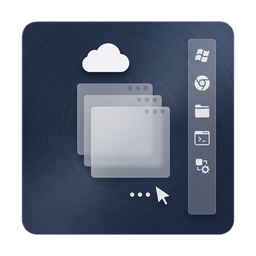

# RemoteAppDock



English | [简体中文](README_CN.md)

A Windows taskbar replacement implemented in Python, designed for RDP RemoteApp environments.

## Use Cases

RemoteAppDock is intended for users who run Windows applications through RDP RemoteApp and miss the regular Windows desktop shell experience. Specifically, it addresses the following gaps in a typical RemoteApp session:

- **Window management**: RemoteApp normally shows only the application window itself. RemoteAppDock restores a taskbar-like window list so you can see and switch between all open windows.
- **Tray icon visibility**: Many Windows applications put important controls in the notification area (system tray). RemoteAppDock hosts these tray icons so they remain visible and usable.
- **Program launcher**: RemoteApp sessions usually do not provide a Start menu or launcher. RemoteAppDock provides a simple application launcher to start additional programs from within the RemoteApp session.

To learn how to create and publish RemoteApp programs on RDP, see the [RemoteApp Tool](https://github.com/kimmknight/remoteapptool) documentation.

## Scope

- Window management (task list)
- Tray management (notification area)
- Taskbar positioning (AppBar)
- Localization (i18n)

## Tech Stack

- Python 3.13
- PySide6
- ctypes / pywin32
- PyInstaller
- uv

## Development

```powershell
uv sync
uv run python -m remoteappdock.main
```

## Testing

```powershell
uv run --group dev pytest
```

## Packaging

```powershell
uv run python -m PyInstaller RemoteAppDock.spec --clean --noconfirm
```

## Acknowledgements

The low-level implementation of the tray protocol and Explorer taskbar control
is derived from and ported after
[ManagedShell](https://github.com/cairoshell/ManagedShell) (C# / .NET, Apache
License 2.0). The affected files carry derivation notices in their headers; see
`NOTICE` for attribution and `third_party/ManagedShell/LICENSE` for the full
Apache-2.0 license text.

## License

RemoteAppDock as a whole is licensed under the [GNU GPL v3](LICENSE) or (at your
option) any later version. The portions ported from ManagedShell are
incorporated under the Apache-2.0 license (which is compatible with GPLv3) and
remain subject to its attribution requirements.
